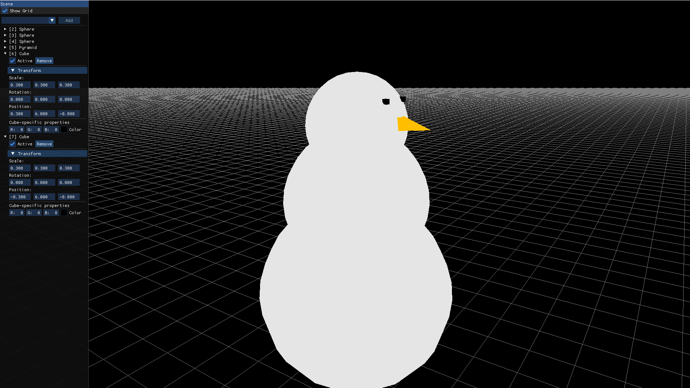

# OpenGL3 Sandbox

This is a low-level rendering engine built upon [GLFW3](https://www.glfw.org/), [GLAD](https://glad.dav1d.de/), and [ImGui](https://github.com/ocornut/imgui) libraries.

In its current state, the program opens an editor interface where various 3D shapes can be assembled.

## Showcase

 

## Controls

The user can move the camera by holding down the Shift key.

The mouse is used to change the camera’s orientation,
while the WASD keys control its position.

Navigation in the 3D space is assisted by a grid, which can be toggled on and off using the Show Grid checkbox.

At the top of the Scene panel located on the left side of the window, elements can be added to the scene.
A dropdown menu allows selection from the available shapes.

The Active checkbox toggles the visibility of a given element.
The Remove button allows you to delete the selected element from the scene.
Within the Transform section, you can scale the element, set its position, and adjust its orientation.

Additionally, you can define the color of each element either by specifying RGB values or by selecting from a color palette.

### Todo
1. Implementation of lights (ambient, directional...)
2. Texture mapping
3. Integration of ray tracing capabilities
4. Asset management system, likely using [assimp](https://github.com/assimp/assimp) for importing 3D models
